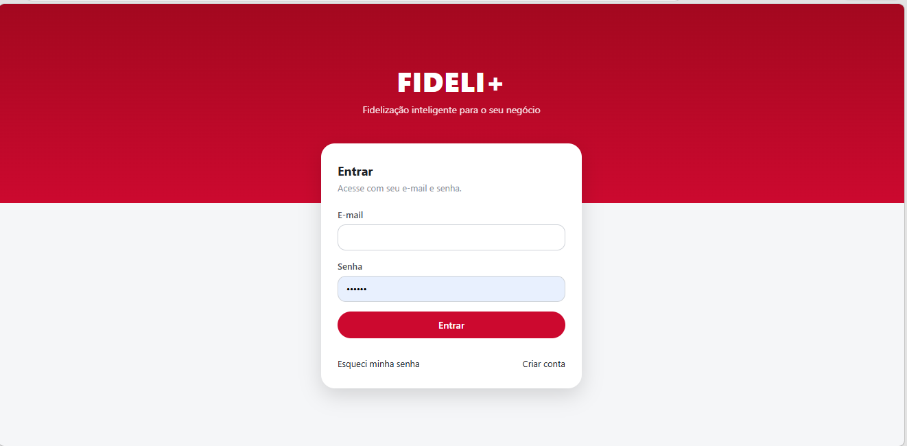
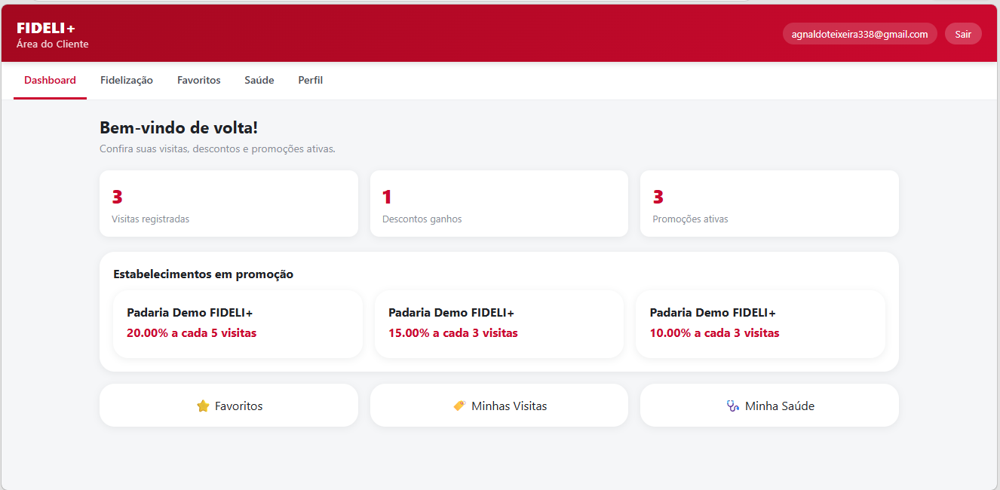
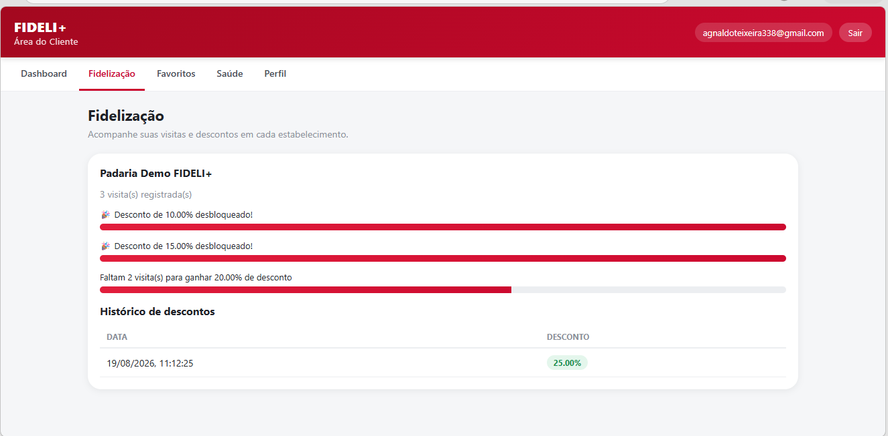
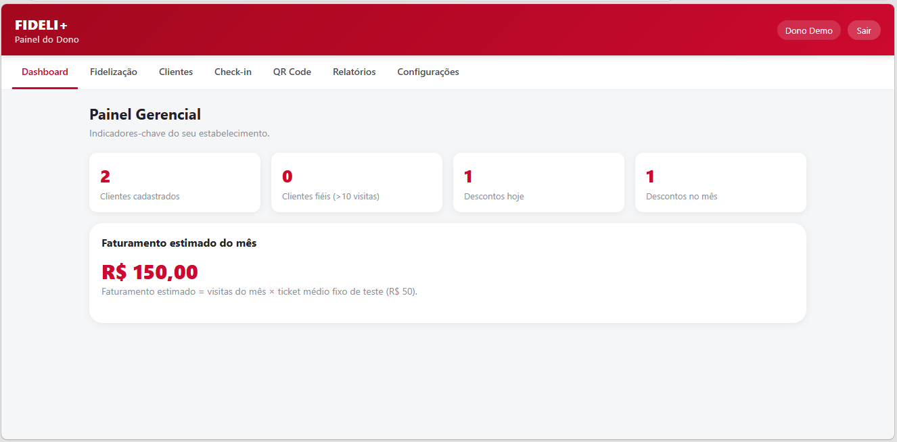
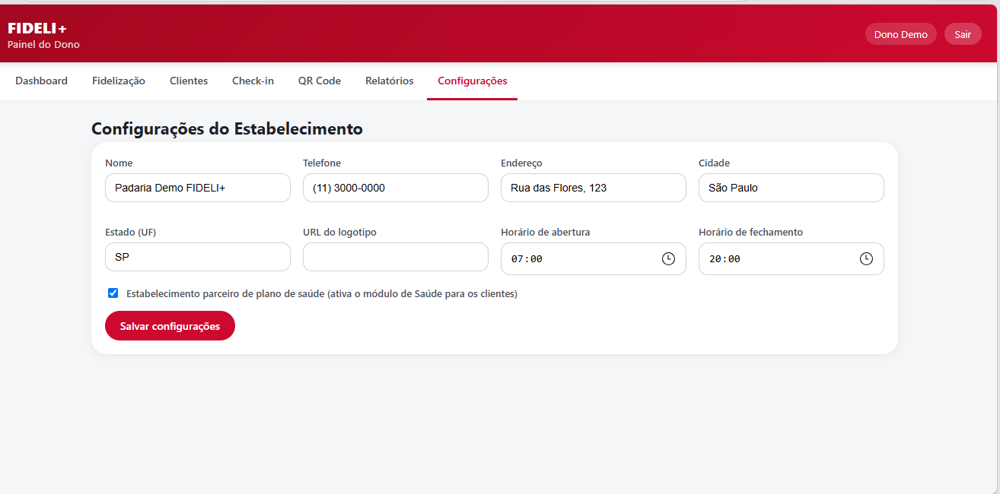
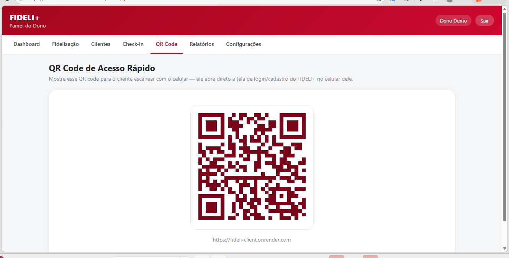
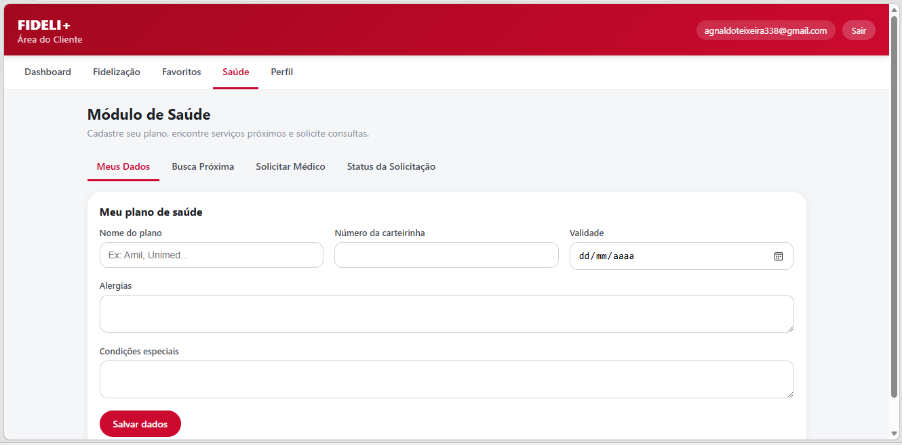
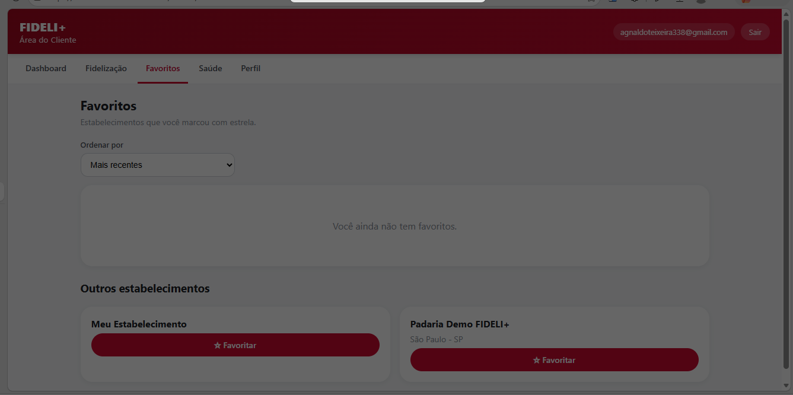
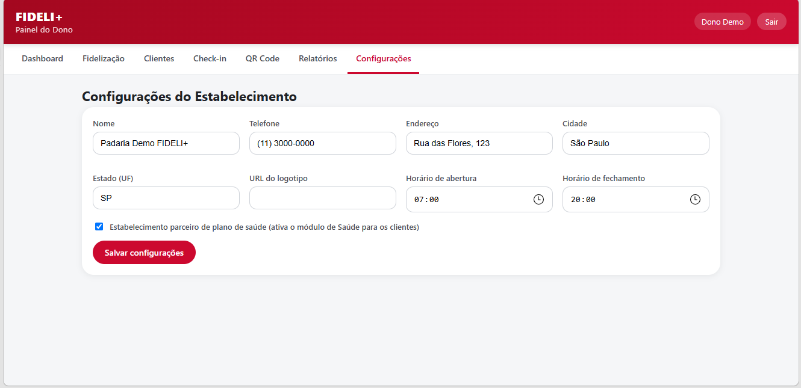

# FIDELI+


-4169E1?style=flat&logo=postgresql&logoColor=white)


Sistema completo de fidelização de clientes para estabelecimentos comerciais (padarias, restaurantes, academias etc.), com contagem automática de visitas, descontos progressivos, favoritos e um módulo de saúde integrado.

**🔗 Demo ao vivo:** [fideli-client.onrender.com](https://fideli-client.onrender.com)
*(o back-end gratuito "dorme" após um tempo sem uso — a primeira requisição pode levar ~30-60s para acordar)*

---

## Capturas de tela

| Login | Dashboard do Cliente |
|---|---|
|  |  |

| Fidelização (progresso de desconto) | Dashboard do Dono |
|---|---|
|  |  |

| Regras de Fidelização | QR Code de Acesso |
|---|---|
|  |  |

| Módulo de Saúde | Favoritos |
|---|---|
|  |  |

| Configurações do Estabelecimento |
|---|
|  |

---

## O problema que o projeto resolve

Fazer um cliente visitar um estabelecimento uma vez é fácil; fazer ele voltar é o difícil. O FIDELI+ transforma cada cliente em um usuário cadastrado, criando um vínculo digital: a cada visita registrada, o sistema conta automaticamente e aplica descontos progressivos definidos livremente pelo dono do estabelecimento (ex.: 10% a cada 3 visitas, 20% a cada 5).

## Funcionalidades

**Autenticação real**
- Cadastro com CPF, celular, e-mail e senha (hash com bcrypt)
- Login com JWT e controle de acesso por papel (Cliente / Dono)
- Recuperação de senha por e-mail + celular

**Módulo de Fidelização**
- Dono cria regras de desconto (nº de visitas × percentual), ativa/desativa quando quiser
- Contagem de visitas automática por check-in manual (CPF)
- Cliente acompanha progresso e histórico de descontos ganhos em tempo real

**Módulo de Favoritos**
- Cliente favorita estabelecimentos, ordena por mais visitados/último desconto
- Dono vê quem favoritou e envia mensagens promocionais direcionadas

**Módulo de Saúde**
- Cadastro de plano de saúde, busca de hospitais/farmácias/médicos próximos
- Solicitação de consulta por especialidade com acompanhamento de status

**Gestão (visão do Dono)**
- Dashboard com indicadores (clientes fiéis, descontos concedidos, faturamento estimado)
- Relatórios exportáveis em CSV
- QR code de acesso rápido gerado na hora para apresentar aos clientes

## Tecnologias

- **Front-end:** React 18, Vite, React Router, CSS puro
- **Back-end:** Node.js, Express, JWT, bcrypt
- **Banco de dados:** PostgreSQL (Neon, serverless)
- **Deploy:** Render (API + site estático), banco na nuvem

## Arquitetura

Front-end e back-end são projetos independentes (`client/` e `server/`), publicados como dois serviços separados no Render e comunicando via REST API. Essa separação permite escalar/depurar cada camada isoladamente e é o mesmo padrão usado em aplicações de produção reais.

```
Fifelidade/
  server/   → API REST (Node/Express) + acesso ao Postgres
  client/   → SPA em React (Vite), consome a API via fetch
```

## Rodando localmente

### 1. Banco de dados (Neon)

Copie `server/.env.example` para `server/.env` e preencha `DATABASE_URL` com a connection string de um projeto Neon (ou qualquer Postgres), e defina um `JWT_SECRET` próprio.

### 2. Back-end

```bash
cd server
npm install
npm run migrar   # cria as tabelas e semeia contas de teste
npm run dev      # API em http://localhost:4000
```

### 3. Front-end

Em outro terminal:

```bash
cd client
npm install
npm run dev       # http://localhost:5173, com proxy para a API
```

## Contas de teste

| Papel   | E-mail                   | Senha    |
|---------|---------------------------|----------|
| Cliente | demo.cliente@fideli.com   | 123456   |
| Dono    | demo.dono@fideli.com      | 123456   |

Use o CPF do cliente demo (`000.000.000-00`) na tela de Check-in (visão do Dono) para testar o fluxo de visitas e descontos.

## O que está mockado nesta versão

- **Google Maps / geolocalização**: busca de hospitais, farmácias e médicos retorna uma lista fixa de demonstração (`server/src/servicos/saudeMock.js`), sem integração real com a API do Google.
- **Notificações push (Firebase)**: substituídas por toasts locais no front-end.
- **Exportação de relatórios**: disponível em CSV; Excel fica para uma próxima versão.
- **Envio de mensagens promocionais**: simulado (retorna a lista de clientes que teriam recebido, sem envio real).
- **Recuperação de senha**: verificação por e-mail + celular, sem envio real de e-mail/SMS.

## Próximos passos

- [ ] Testes automatizados (Jest/Vitest) para a lógica de cálculo de desconto
- [ ] Integração real com Google Maps API e Firebase Cloud Messaging
- [ ] Exportação de relatórios em Excel
- [ ] Envio real de e-mail/SMS na recuperação de senha

---

## Autor

**Agnaldo Teixeira**

[](https://www.linkedin.com/in/agnaldo-teixeira-329585307)
[](https://github.com/agnaldoteixeira338-code)
[](mailto:agnaldoteixeira338@gmail.com)
